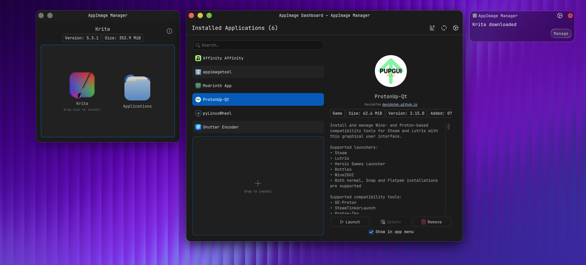

#  AppImage Manager

A lightweight, native AppImage manager for KDE Plasma 6.

[](https://kde.org/plasma-desktop/)
[](https://www.qt.io/)
[](https://en.cppreference.com/w/cpp/20)
[](LICENSES/GPL-2.0-or-later.txt)
[](https://www.kernel.org/)
[](https://github.com/strandzen/AppImage-Manager)

> **Disclaimer:** This project is vibecoded.

---




- **Native Dashboard:** Browse, search, and sort installed AppImages by name, size, category, or date.
- **Rich Metadata:** Shows app icon, version, size, category, and AppStream description extracted directly from the AppImage.
- **Dolphin Integration:** Right-click any `.AppImage` to open the management window directly.
- **Drag-and-Drop Install:** Drag an AppImage onto the dashboard to move it to your Applications folder and create desktop shortcuts automatically.
- **Clean Uninstall:** Scans for leftover configuration and cache directories, moving everything to the KDE Trash instead of leaving orphans behind.
- **Detailed Storage View:** Quickly see an AppImage's file size and its associated directories.
- **Download Notifications:** Optionally watches `~/Downloads` and fires a native KDE notification when a new `.AppImage` is detected — click "Manage" to open it immediately.
- **AppImage Updates:** Checks for newer versions via GitHub Releases and downloads updates using `zsync` delta-patching.
- **Plasma Integration:** Uses native Plasma progress bars, Kirigami styling, and KDE notifications.

---


To build this project from source, you need:

- **Build Tools:** CMake 3.22+, Ninja, a C++20 compiler (GCC 12+ or Clang 15+)
- **Qt 6.6+ Modules:** Core, Gui, Quick, Qml, Concurrent, Network
- **KDE Frameworks 6:** CoreAddons, I18n, KIO, IconThemes, Notifications, Crash, DBusAddons, Kirigami
- **Optional:** `libappimage` for faster, in-process metadata extraction.

---


<details>
<summary><strong>Arch Linux</strong></summary>

```bash
sudo pacman -S base-devel cmake extra-cmake-modules ninja \
    qt6-base qt6-declarative qt6-networkauth \
    kcoreaddons ki18n kio kiconthemes knotifications kcrash kdbusaddons kirigami \
    libappimage
```

</details>

<details>
<summary><strong>Fedora</strong></summary>

```bash
sudo dnf install gcc-c++ cmake extra-cmake-modules ninja-build \
    qt6-qtbase-devel qt6-qtdeclarative-devel qt6-qtnetworkauth-devel \
    kf6-kcoreaddons-devel kf6-ki18n-devel kf6-kio-devel kf6-kiconthemes-devel \
    kf6-knotifications-devel kf6-kcrash-devel kf6-kdbusaddons-devel kf6-kirigami-devel
```

</details>

<details>
<summary><strong>Debian / Ubuntu (24.04+)</strong></summary>

```bash
sudo apt install build-essential cmake extra-cmake-modules ninja-build \
    qt6-base-dev qt6-declarative-dev libqt6networkauth6-dev \
    libkf6coreaddons-dev libkf6i18n-dev libkf6kio-dev libkf6iconthemes-dev \
    libkf6notifications-dev libkf6crash-dev libkf6dbusaddons-dev \
    qml6-module-org-kde-kirigami
```

</details>

<details>
<summary><strong>openSUSE Tumbleweed</strong></summary>

```bash
sudo zypper in gcc-c++ cmake extra-cmake-modules ninja \
    qt6-base-devel qt6-declarative-devel qt6-networkauth-devel \
    kf6-kcoreaddons-devel kf6-ki18n-devel kf6-kio-devel kf6-kiconthemes-devel \
    kf6-knotifications-devel kf6-kcrash-devel kf6-kdbusaddons-devel kf6-kirigami-devel
```

</details>

---


Once your dependencies are installed, you can build and install the manager globally.

```bash
# Configure and build the project
cmake --preset dev
cmake --build --preset dev

# Install to /usr (required for Dolphin plugin discovery)
sudo cmake --install build/dev
```

To reload the Dolphin context menu without logging out:

```bash
kquitapp6 dolphin && dolphin &
```

---


Run the utility from your terminal or application launcher:

| Command | Action |
| --- | --- |
| `appimagemanager` | Opens the main dashboard to view all installed AppImages. |
| `appimagemanager /path/to/app.AppImage` | Opens the management window for a specific AppImage file. |
| `appimagemanager --daemon` | Runs the background update checker (autostarts on login). |

**Dolphin Integration:** Simply right-click any `.AppImage` file and select **Manage AppImage**.

---


Licensed under the **GPL-2.0-or-later**. See [LICENSES/GPL-2.0-or-later.txt](LICENSES/GPL-2.0-or-later.txt) for details.
