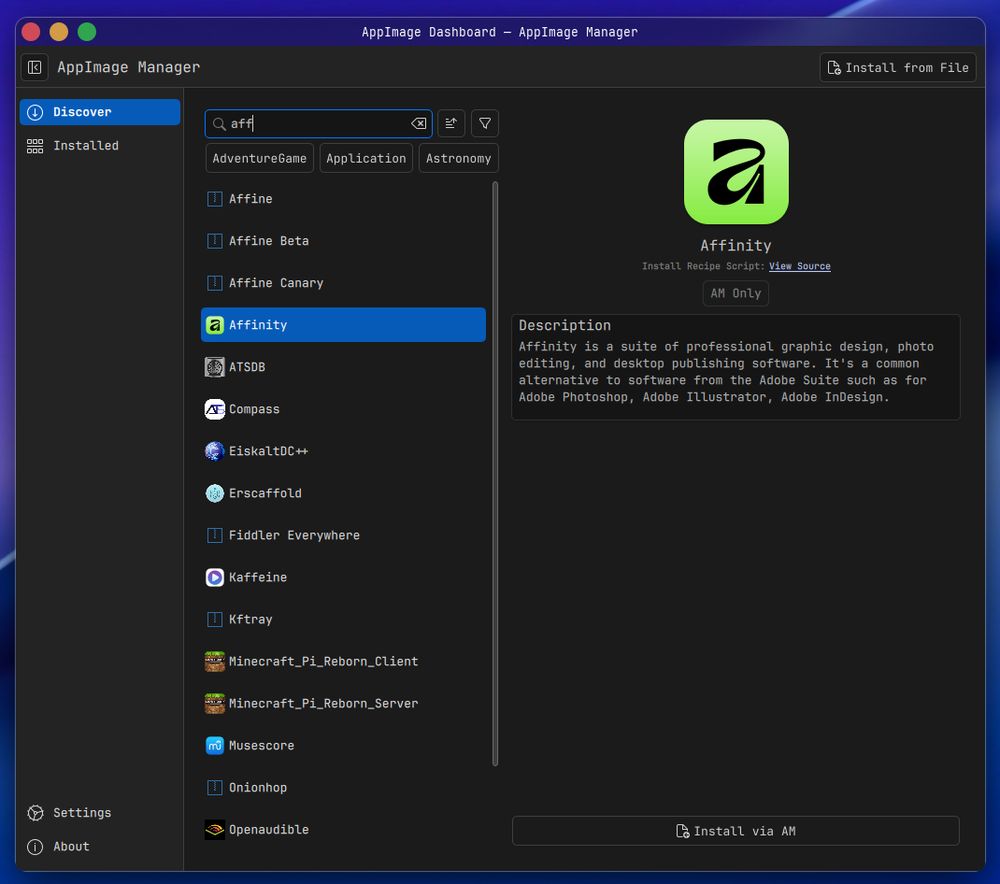
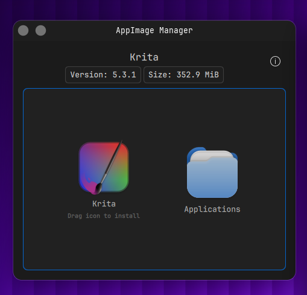

#  AppImage Manager

A lightweight, native AppImage manager for KDE Plasma 6.

[](https://kde.org/plasma-desktop/)
[](https://www.qt.io/)
[](https://en.cppreference.com/w/cpp/20)
[](LICENSES/GPL-2.0-or-later.txt)
[](https://www.kernel.org/)
[](https://aur.archlinux.org/packages/appimage-manager-plasma)

> **Disclaimer:** This project is vibecoded — built with heavy AI assistance. It is also an independent, community-driven effort and is not affiliated with or endorsed by KDE or the KDE e.V. organization.

---





---

## Installation

### Arch Linux (AUR) — recommended

```bash
yay -S appimage-manager-plasma
```

> **Note:** `libappimage` is an AUR dependency and will be pulled in automatically by your AUR helper.

### Other distributions

Other distros are not validated. Build from source at your own risk — see [Build & Install](#build--install) below.

---

## Features

- **Dashboard:** Browse, search, and sort all installed AppImages by name, size, category, or date. Sidebar navigation with Installed, Discover, Settings, and About sections.
- **Rich Metadata:** Displays app icon, version, size, category, and AppStream description extracted directly from each AppImage.
- **Discover Page:** Browse and install from the combined AM database and AppImage Hub catalog (~1,300 curated apps). Supports both `am` script installs and direct HTTP downloads — no browser redirect.
- **Dolphin Integration:** Right-click any `.AppImage` in Dolphin to open the management window directly.
- **Drag-and-Drop Install:** Drag an AppImage onto the management window or dashboard to install it into the configured Applications folder with desktop integration.
- **GPG Signature Verification:** Optional pre-install check. Parses embedded ELF signature sections and invokes `gpg` to verify authenticity. Warns on unsigned files; blocks tampered ones.
- **Clean Uninstall:** Detects leftover configuration and cache directories after removal. Moves everything to KDE Trash — no permanent deletion.
- **AppImage Updates:** Checks for newer versions asynchronously. Downloads updates via `zsync2` delta-patching with a full HTTP fallback when `zsync2` is unavailable.
- **Background Daemon:** Persistent system tray entry with hourly update scans and Downloads folder monitoring. Prevents duplicate notifications when the dashboard is also open.
- **Download Notifications:** Watches `~/Downloads` and fires a native KDE notification when a new `.AppImage` appears — click "Manage" to open it immediately.
- **Plasma Integration:** Native Kirigami styling, KDE notifications, KIO file operations, and XDG desktop/icon database integration for compatibility with non-Plasma launchers.
- **First-Run Wizard:** Guides new users through folder setup and desktop integration on first launch.

---

## Requirements

- **Build Tools:** CMake 3.22+, Ninja, C++20 compiler (GCC 12+ or Clang 15+)
- **Qt 6.9+:** Core, Gui, Quick, Qml, Concurrent, Network, Sql, Svg
- **KDE Frameworks 6:** CoreAddons, I18n, Config, KIO, IconThemes, Notifications, Crash, DBusAddons, StatusNotifierItem, Kirigami, KirigamiAddons
- **Required:** `libappimage` for in-process SquashFS metadata extraction
- **Optional:** `gpg`/`gpg2` for signature verification; `zsync2` for delta updates; `am` for script installations from the Discover page

---

## Installing Dependencies

<details>
<summary><strong>Arch Linux</strong></summary>

```bash
sudo pacman -S base-devel cmake extra-cmake-modules ninja \
    qt6-base qt6-declarative qt6-svg \
    kcoreaddons ki18n kconfig kio kiconthemes knotifications kcrash kdbusaddons \
    kirigami kirigami-addons kstatusnotifieritem gnupg
# libappimage is AUR only:
# yay -S libappimage
# Optional: AUR packages for Discover page script installs:
# yay -S am-git zsync2
```

</details>

<details>
<summary><strong>Fedora</strong></summary>

```bash
sudo dnf install gcc-c++ cmake extra-cmake-modules ninja-build \
    qt6-qtbase-devel qt6-qtdeclarative-devel qt6-qtsvg-devel \
    kf6-kcoreaddons-devel kf6-ki18n-devel kf6-kconfig-devel kf6-kio-devel kf6-kiconthemes-devel \
    kf6-knotifications-devel kf6-kcrash-devel kf6-kdbusaddons-devel kf6-kstatusnotifieritem-devel \
    kf6-kirigami-devel kf6-kirigami-addons-devel libappimage-devel gnupg2
```

</details>

<details>
<summary><strong>Debian / Ubuntu (24.04+)</strong></summary>

```bash
sudo apt install build-essential cmake extra-cmake-modules ninja-build \
    qt6-base-dev qt6-declarative-dev libqt6svg6-dev \
    libkf6coreaddons-dev libkf6i18n-dev libkf6config-dev libkf6kio-dev libkf6iconthemes-dev \
    libkf6notifications-dev libkf6crash-dev libkf6dbusaddons-dev libkf6statusnotifieritem-dev \
    qml6-module-org-kde-kirigami qml6-module-org-kde-kirigamiaddons \
    libappimage-dev gnupg2
```

</details>

<details>
<summary><strong>openSUSE Tumbleweed</strong></summary>

```bash
sudo zypper in gcc-c++ cmake extra-cmake-modules ninja \
    qt6-base-devel qt6-declarative-devel qt6-svg-devel \
    kf6-kcoreaddons-devel kf6-ki18n-devel kf6-kconfig-devel kf6-kio-devel kf6-kiconthemes-devel \
    kf6-knotifications-devel kf6-kcrash-devel kf6-kdbusaddons-devel kf6-kstatusnotifieritem-devel \
    kf6-kirigami-devel kf6-kirigami-addons-devel libappimage-devel gpg2
```

</details>

---

## Build & Install

```bash
cmake --preset release
cmake --build --preset release
sudo cmake --install build/release
```

To reload the Dolphin context menu without logging out:

```bash
kquitapp6 dolphin && dolphin &
```

---

## Usage

| Command | Action |
|---------|--------|
| `appimagemanager` | Opens the dashboard. |
| `appimagemanager /path/to/app.AppImage` | Opens the management window for a specific file. |
| `appimagemanager --daemon` | Runs the background update checker (autostarts on login). |

**Dolphin:** Right-click any `.AppImage` file and select **Manage AppImage**.

---

## License

Licensed under the **GPL-2.0-or-later**. See [LICENSES/GPL-2.0-or-later.txt](LICENSES/GPL-2.0-or-later.txt) for details.
