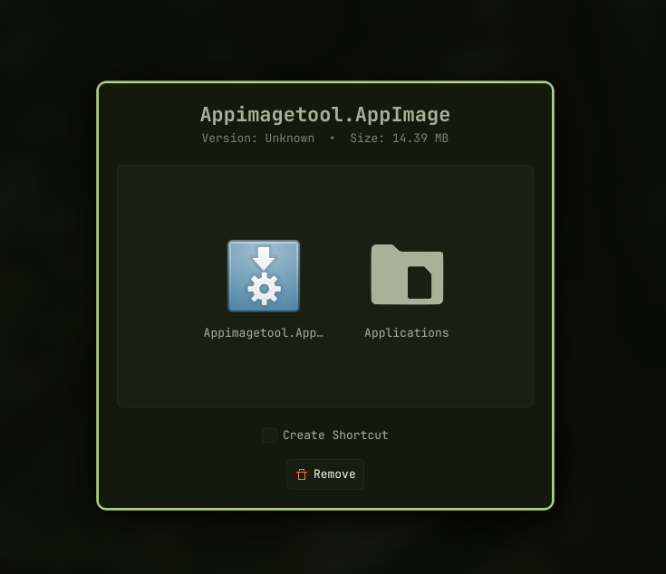
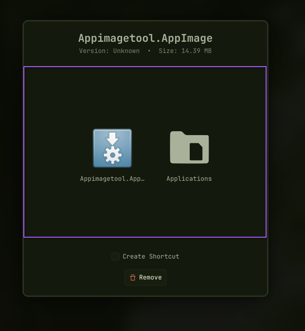

# AppImage Manager

<p align="center">
  
  
</p>

A lightweight, native AppImage manager for KDE Plasma.

AppImage Manager integrates directly into your KDE desktop environment to handle AppImage files efficiently. It replaces the manual process of moving files, making them executable, and creating menu shortcuts with a clean, macOS-style installation window.

## Features

- **macOS-Style Installation**: Drag and drop the AppImage into the Applications folder directly from the popup window.
- **Context Menu Plugin**: Adds a "Manage AppImage" option to the Dolphin right-click context menu.
- **Desktop Shortcuts**: Automatically extracts the internal icon and creates a `.desktop` shortcut in your application menu. Preserves original `Exec` arguments (e.g., `--no-sandbox`).
- **Clean Uninstallation**: Scans `~/.config`, `~/.cache`, and `~/.local/share` for leftover files ("corpses") and allows you to safely remove them alongside the AppImage.

## Installation

To set up the KDE Plasma integration, clone the repository and run the setup script:

```bash
python3 cli.py setup
```

This command will create a KIO Service Menu in `~/.local/share/kio/servicemenus/` to enable the right-click option in Dolphin.

## Usage

**Installing an AppImage:**
1. Right-click any `.AppImage` file and select "Manage AppImage".
2. Drag the application icon to the folder icon in the center of the window. The file will be moved to `~/Applications/` and made executable.
3. Check the "Create Shortcut" box to add it to your system application launcher.

**Uninstalling an AppImage:**
1. Right-click an installed AppImage and select "Manage AppImage".
2. Click "Remove".
3. A window will list the AppImage file along with any related configuration or cache directories found on your system. Select the items you want to delete and confirm.

## Requirements

### Python Environment
- **Python 3.9+**
- **PySide6**: 
  ```bash
  pip install -r requirements.txt
  ```

### System Dependencies
The application leverages native KDE Plasma 6 features and system utilities for performance and security. Ensure the following are installed via your package manager (e.g., `apt`, `pacman`, `dnf`):

- **KDE Frameworks 6**:
    - `kirigami`: Required for the modernized UI components.
    - `kio`: Provides `kioclient` for native file movement with progress notifications.
    - `kservice`: Provides `kbuildsycoca6` to instantly update the application menu.
- **Filesystem Utilities**:
    - `squashfuse`: Enables instantaneous, non-destructive metadata extraction from AppImages.
    - `fuse` (or `fuse3`): Required for `fusermount`, used to cleanly unmount images after inspection.
- **System Icons**: A standard icon theme (like Breeze or Papirus) is recommended for the best visual experience.

#### Quick Install (System Dependencies)

**Ubuntu/Debian/KDE Neon:**
```bash
sudo apt install squashfuse fuse3 libkf6kirigami-dev kio kservice
```

**Arch Linux:**
```bash
sudo pacman -S squashfuse fuse3 kirigami kio kservice6
```

**Fedora:**
```bash
sudo dnf install squashfuse fuse3 kf6-kirigami kio kf6-kservice
```

## Roadmap

Future planned features for AppImage Manager:
- **Delta Updates**: Implementation of `zsync` / `AppImageUpdate` for automatic delta updates of installed AppImages.
- **Orphan Cleanup Daemon**: A background service utilizing `inotify` to automatically remove `.desktop` shortcuts when an AppImage is manually deleted from the `~/Applications` folder.
