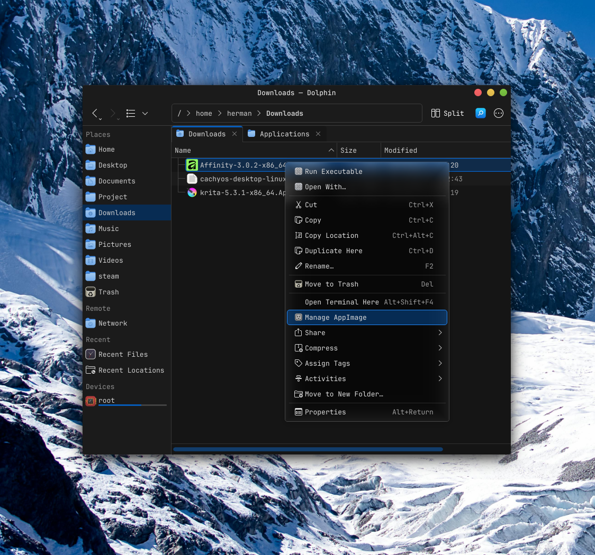
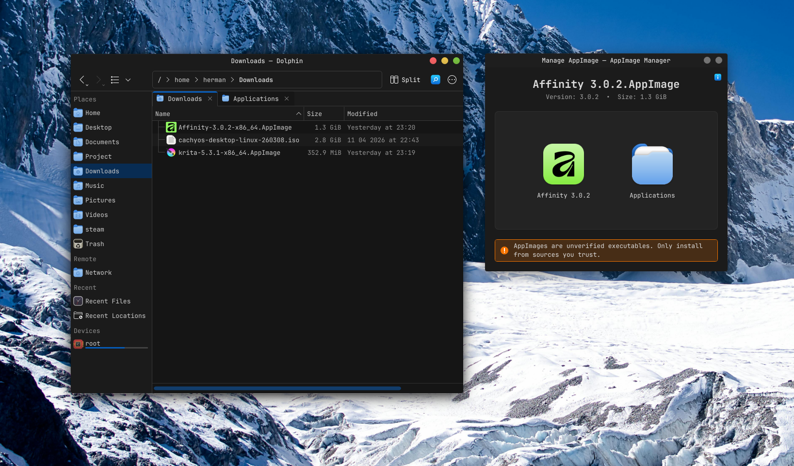
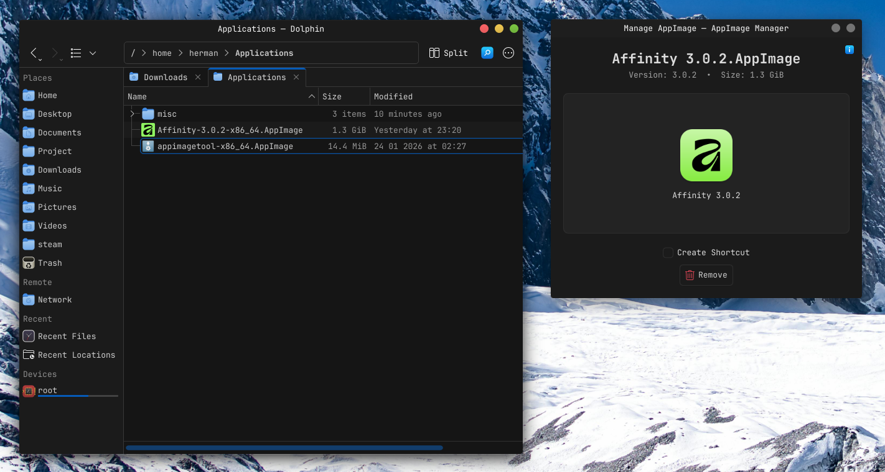

# AppImage Manager

<p align="center">
  
  
</p>
<p align="center">
  
</p>
<p align="center">
  
</p>

> **Disclaimer:** Portions of this project were assisted, generated, or heavily refactored by AI (Claude / Gemini). Always review the code before deploying to production environments.

A lightweight, native AppImage manager for KDE Plasma 6.

AppImage Manager integrates directly into Dolphin to handle AppImage files with a clean, focused UI. It replaces the manual process of moving files, making them executable, and creating menu shortcuts.

## Features

- **Drag-and-Drop Installation**: Drag the app icon onto the Applications folder in the popup window to move the AppImage to `~/Applications/` and make it executable.
- **Click to Launch**: Once installed, click the app icon in the manager window to launch the AppImage directly.
- **Dolphin Plugin**: Adds a "Manage AppImage" option to the right-click context menu — auto-discovered by Dolphin, no configuration needed.
- **Smart Desktop Integration**: Checks your icon theme first (Papirus, YAMIS, etc.) for a native look. Falls back to the icon embedded inside the AppImage.
- **Clean Uninstallation**: Asynchronously scans `~/.config`, `~/.cache`, and `~/.local/share` for leftover files ("corpses") with a built-in blacklist to prevent false positives. Items are moved to the KDE Trash, not permanently deleted.
- **Deletion Confirmation**: A confirmation dialog lists all selected items before anything is moved to Trash.
- **Completion Sound**: Plays the `outcome-success` sound from your KDE sound theme when an AppImage is successfully installed.
- **Security Disclaimer**: Warns about unverified executables before installation. Disappears once the AppImage is placed in `~/Applications/`.
- **About Dialog**: Access version and project info via the **?** button in the top-right corner.
- **Responsive UI**: Metadata extraction and file scanning run on background threads — the UI never blocks.

## Installation

### Using CMake Presets (recommended)

```bash
cmake --preset release
cmake --build --preset release
sudo cmake --install build/release
```

### Manual

```bash
cmake -B build -DCMAKE_INSTALL_PREFIX=/usr
cmake --build build --parallel
sudo cmake --install build
```

After installation, restart Dolphin (or log out and back in) to activate the plugin.

### Uninstallation

```bash
sudo cmake --build build --target uninstall
```

## Usage

**Installing an AppImage:**

1. Right-click any `.AppImage` file in Dolphin and select **Manage AppImage**.
2. Drag the app icon onto the Applications folder icon. The file is moved to `~/Applications/` and made executable. A completion sound plays on success.
3. Check **Create Shortcut** to add an entry to your application launcher.

**Launching an installed AppImage:**

- Click the app icon in the manager window to launch it directly.

**Uninstalling an AppImage:**

1. Right-click the installed AppImage and select **Manage AppImage**.
2. Click **Remove**.
3. A window lists the AppImage and any related config/cache files found on your system. Select the items to delete, click **Remove**, and confirm — all selected items are moved to Trash.

## Requirements

### Build Dependencies

| Component | Minimum version |
| --- | --- |
| C++20 compiler (GCC or Clang) | GCC 12 / Clang 15 |
| CMake | 3.22 |
| Extra CMake Modules (ECM) | 6.0 |
| Qt6 (Core, Gui, Quick, Qml, Concurrent) | 6.6 |
| KDE Frameworks 6: CoreAddons, I18n, KIO, IconThemes, Notifications, Crash, DBusAddons | 6.0 |
| Kirigami (ships with Plasma 6) | 6.0 |

**Optional:**

- `libappimage` — enables in-process SquashFS metadata extraction without requiring FUSE at runtime.
- `libcanberra` — plays the `outcome-success` completion sound when an AppImage is installed. Falls back to silence if not found at build time.

#### Arch Linux

```bash
sudo pacman -S base-devel cmake extra-cmake-modules \
  qt6-base qt6-declarative \
  kcoreaddons ki18n kio kiconthemes \
  knotifications kcrash kdbusaddons kirigami \
  libcanberra
```

#### Ubuntu / Debian / KDE Neon

```bash
sudo apt install build-essential cmake extra-cmake-modules \
  qt6-base-dev qt6-declarative-dev \
  libkf6coreaddons-dev libkf6i18n-dev libkf6kio-dev \
  libkf6iconthemes-dev libkf6notifications-dev \
  libkf6crash-dev libkf6dbusaddons-dev \
  libkf6kirigami-dev libcanberra-dev
```

#### Fedora

```bash
sudo dnf install gcc-c++ cmake extra-cmake-modules \
  qt6-qtbase-devel qt6-qtdeclarative-devel \
  kf6-kcoreaddons-devel kf6-ki18n-devel kf6-kio-devel \
  kf6-kiconthemes-devel kf6-knotifications-devel \
  kf6-kcrash-devel kf6-kdbusaddons-devel \
  kf6-kirigami-devel libcanberra-devel
```

### Runtime Dependencies

- **squashfuse** and **fusermount3** — only required when `libappimage` is not available at compile time (used as a fallback for Type 2 AppImage metadata extraction).

> **AppImage format support:** Type 2 AppImages (squashfs-based) are fully supported. Type 1 AppImages (ISO9660) fall back to `--appimage-extract` for metadata; this requires the AppImage itself to be executable.

## Dolphin Integration

The app ships two integration mechanisms:

- **KFileItemAction plugin** (`kf6/fileitemaction/appimagemanager.so`) — auto-discovered by Dolphin 24.02+. No setup needed after install.
- **KIO Service Menu** (`kio/servicemenus/org.kde.appimagemanager.desktop`) — fallback for file managers that support service menus but not KFileItemAction plugins. Also allows invoking the app directly via `appimagemanager <file>`.

## Roadmap

- **Delta Updates**: Integration with `zsync` / AppImageUpdate for in-place updates of installed AppImages.
- **Orphan Cleanup**: An `inotify`-based background service to remove stale `.desktop` shortcuts when an AppImage is deleted from `~/Applications/`.
