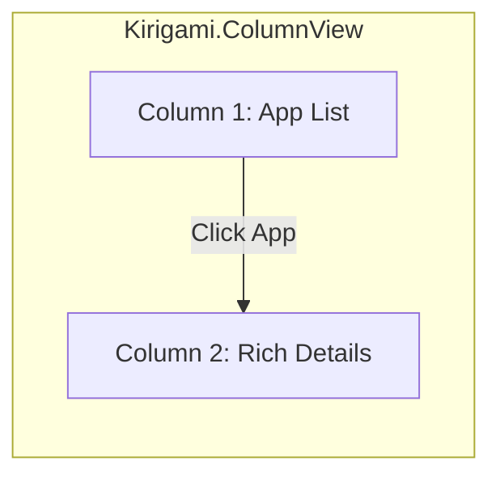

# UI/UX Redesign Proposal: AppImage Manager (Kirigami Edition)

*Authored by a Senior KDE Contributor / Developer*

As a utility built for KDE Plasma 6, AppImage Manager has an incredibly strong functional foundation. Its performance, thread safety, and core framework integrations (`KIO`, `KConfigXT`, `KNotification`) are exemplary. 

However, from a visual and UX perspective, the interfaces are currently relying on custom-built layout code (like manually calculating alternate row backgrounds, explicit left/right panel widths, and a custom drag-and-drop "mini-game" in the installer). This custom approach misses out on Kirigami's unified design language, animations, responsive ergonomics, and system palette integrations.

This proposal outlines how to elevate the UI to a premium, modern KDE aesthetic.

---

## 🎨 Architectural Transformation: The Core Redesigns

### 1. The Dashboard: Migration to `Kirigami.ColumnView`
The current master-detail view in `DashboardWindow.qml` splits the window into left/right panes using a custom `RowLayout` with hardcoded widths and manual visibility bindings.

```
Current Dashboard UI (Custom Split View):
+-----------------------------------+-----------------------------------+
|  [Search...]                      |            [ App Icon ]           |
|  +-----------------------------+  |         AppImage Manager          |
|  | App A                       |  |         Version: 1.4.0            |
|  | App B                       |  |  [ Launch ] [ Update ] [ Remove ]  |
|  | App C                       |  |  -------------------------------- |
|  +-----------------------------+  |  Description scrollable text...   |
+-----------------------------------+-----------------------------------+
```

#### 🔄 The Kirigami Solution: `Kirigami.ColumnView`
In KDE, **`ColumnView` is the absolute standard for master-detail interfaces** (seen in Discover, System Settings, and KMail). The window behaves as an infinite canvas of columns sliding horizontally.
- **Column 1 (List Column)**: Hosts a clean, simplified list of installed AppImages.
- **Column 2 (Detail Column)**: Pushed to the view when an item is selected.



#### 🌟 Why this is superior:
*   **Responsive out of the box**: On desktop, the columns sit beautifully side-by-side. On mobile or narrow windows, the detail page slides in full-screen, with a native back button, without writing a single line of state code.
*   **Tactile Navigation**: Native page transition animations, focus management, and breadcrumbs.
*   **True Keyboard Flow**: Selecting an app with arrow keys and hitting `Right` slides in the details pane naturally.

---

### 2. UI Elements: Upgrading to `Kirigami.AbstractListItem` and `Kirigami.Cards`
Currently, the App List delegate is a custom `Item` with custom mouse hover behaviors and manual alternating background colors.

```qml
// Current: Manual colors, margins, and hover states
Rectangle {
    color: delegateRoot.isCurrent
           ? Kirigami.Theme.highlightColor
           : delegateMouse.containsMouse
             ? Kirigami.Theme.hoverColor
             : index % 2 === 0
               ? Kirigami.Theme.backgroundColor
               : Kirigami.Theme.alternateBackgroundColor
}
```

#### 🔄 The Kirigami Solution:
We replace this with `Kirigami.AbstractListItem`.

```qml
Kirigami.AbstractListItem {
    id: delegate
    contentItem: RowLayout {
        // ... Layout elements
    }
    actions: [
        Kirigami.Action {
            icon.name: "media-playback-start"
            tooltip: i18n("Launch")
            onTriggered: proxyModel.requestLaunch(index)
        }
    ]
}
```

#### 🌟 Why this is superior:
*   **KDE Theme Fidelity**: `AbstractListItem` automatically handles hover, active focus, highlighted states, and theme colors correctly, ensuring it looks native on standard dark/light themes (Breeze, Breeze Dark) or custom user color schemes.
*   **Quick Actions**: Swiping/hovering on an item can reveal slide-in inline actions (like "Launch" or "Update") which keeps the interface quick to use.

---

### 3. The Installer: Redesigning the Drag-to-Install Layout
The current `ManageWindow.qml` uses a visual grid where the user drags the application icon onto a file-manager icon to install it. 

While creative, it creates high cognitive load for quick installs:
*   The "mini-game" feels out of place compared to standard software installation tools.
*   It does not scale gracefully if the window is resized.
*   It requires maintaining custom mouse coordinate tracking and snapping animations in QML.

#### 🔄 The Kirigami Redesign: The "Interactive Hero Card"
We replace the drag-to-install box with a gorgeous **Hero Card** workflow that supports click-to-install or *ambient* drag-and-drop.

```
Proposed Premium Installer UI:
+-----------------------------------------------------------+
|                        AppImage                           |
+-----------------------------------------------------------+
|                                                           |
|                       [ App Icon ]                        |
|                     AppImage Manager                      |
|                  Version 1.4.0 • 12.4 MB                  |
|                                                           |
|    +-------------------------------------------------+    |
|    |  ⚠️ AppImages are unverified executables.        |    |
|    |  Only install from sources you trust.           |    |
|    +-------------------------------------------------+    |
|                                                           |
|             [ Install AppImage ]  [ Launch ]              |
|                                                           |
|            - or drag a file anywhere to install -         |
+-----------------------------------------------------------+
```

*   **State 1: Not Installed**: Displays a large visual card with the app's meta information. A primary, colored "Install AppImage" button is at the center. Dropping the file anywhere on the window installs it.
*   **State 2: Installing**: Smoothly cross-fades into a native Kirigami loading progress card with a spinning wheel and discrete text ("Moving to Applications...", "Creating shortcuts...").
*   **State 3: Installed**: Replaces the Install button with a prominent, highlighted "Launch" button and shows a "Successfully Installed!" success banner.

---

## 💎 Premium Aesthetic Enhancements

To make the app feel **premium and tasteful**, we should integrate several micro-interactions and visual cues:

| Area | Current Approach | Premium Redesign |
| :--- | :--- | :--- |
| **App Detail Hero** | Centered icon with a simple label. | A modern **Hero Header** with a larger, softly-shadowed icon, subtle developer subtitle, and a dedicated **Primary Action Area** utilizing a gradient accent background. |
| **Information Layout** | Vertical text fields and chips mixed together. | Use **`Kirigami.Cards`** to segment details: <br>1. *Overview Card* (Size, Version, Install Date)<br>2. *Description Card* (Scrollable text)<br>3. *Metadata & Sandbox status Card* |
| **Active States** | No accent highlighting. | Use **Active Highlight Borders** (`AppSettings.accentBorders`) to softly glow active/highlighted elements matching the system's global accent color. |
| **Empty States** | Standard ColumnLayout with icon and label. | Use **`Kirigami.PlaceholderMessage`** which natively renders beautiful vector graphics, headers, and descriptions for empty libraries. |

---

## 🎨 Interactive Mockup Visualizations

Here is a visual mockup of how the **App Detail Page** will look when refactored into segmented, beautiful Kirigami Cards:

````carousel
```
+-----------------------------------------------------+
|                  [ HERO HEADER ]                    |
|                    (App Icon)                       |
|                 AppImage Manager                    |
|             By Herman (strandzen.github.io)         |
+-----------------------------------------------------+
| [ Overview Card ]                                   |
|  • Version: 1.4.0          • Size: 24.5 MB         |
|  • Installed: May 31, 2026  • Category: System       |
+-----------------------------------------------------+
| [ Description Card ]                                |
|  A lightweight KDE Plasma utility for managing      |
|  AppImage binaries, updates, and desktop shortcuts. |
+-----------------------------------------------------+
| [ Actions ]                                         |
|    [ LAUNCH (Primary) ]  [ Update ]  [ Uninstall ]  |
+-----------------------------------------------------+
```
<!-- slide -->
```
+-----------------------------------------------------+
|               [ INSTALLING STATE ]                  |
|                    (App Icon)                       |
|                 AppImage Manager                    |
+-----------------------------------------------------+
|                                                     |
|             Installing AppImage...                 |
|             [=======================] 45%           |
|             Copying to Applications folder...       |
|                                                     |
+-----------------------------------------------------+
```
````

---

## 🚀 Recommended Action Plan

We can execute these UI/UX improvements incrementally. Here is the recommended path:

1.  **Step 1**: Refactor `DashboardWindow.qml` to utilize `Kirigami.ColumnView`. This will clean up the master-detail architecture and instantly make the dashboard feel like a native system application.
2.  **Step 2**: Upgrade list delegates in `DashboardWindow` to use `Kirigami.AbstractListItem` with sliding actions.
3.  **Step 3**: Rewrite `ManageWindow.qml` to use the **Hero Card / Click-to-Install** flow instead of the manual coordinate dragging mini-game.
4.  **Step 4**: Apply the `Kirigami.Cards` layout inside the App Detail pane for beautiful grouping and text wrapping.

---

### 💬 Design Alignment
What are your thoughts on this design direction? We can begin implementing the **`Kirigami.ColumnView`** migration for the dashboard right away to establish the core layout. Please let me know which step you would like to proceed with!
