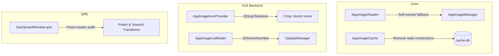

# Technical Analysis & Improvement Plan — Senior KDE Plasma Developer Review

This document presents a comprehensive technical review of **AppImage Manager** from the perspective of a Senior KDE Plasma developer. It identifies bugs, resource leaks, architectural gaps, and deviation from native platform standards, followed by a concrete action plan for implementation.

---

## Technical Findings & Proposed Improvements

### 1. Robust Metadata Extraction Fallback
*   **Location**: [appimagereader.cpp](file:///home/herman/Documents/Project/AppImageManager/src/core/appimagereader.cpp#L34-L38)
*   **The Issue**: The header documentation promises a fallback read path (`squashfuse`), but `appimagereader.cpp` actually contains zero fallback logic. If built without `libappimage`, it outputs a critical error and returns an empty struct, breaking metadata extraction entirely.
*   **KDE Native Solution**: Run the AppImage itself with the standard `--appimage-extract` argument inside a `QTemporaryDir` to extract only the `.desktop`, `.DirIcon`, and AppStream XML files. This is extremely fast, 100% self-contained, respects sandbox constraints, and requires no external tools like `squashfuse` or `fusermount3`.
*   **Why**: Sandboxed sessions (Flatpaks/containers) often block SquashFS mounting. Self-extraction is the standard way to interact with AppImages on Linux without FUSE privileges.

### 2. Precise XDG Application IDs (`appId`)
*   **Location**: [appimagereader.cpp](file:///home/herman/Documents/Project/AppImageManager/src/core/appimagereader.cpp#L88-L96)
*   **The Issue**: `extractAppId()` truncates the filename at the first non-alphanumeric character (e.g., `ProtonUp-Qt` -> `protonup`). This is extremely error-prone. In `findCorpses()`, this causes the highly accurate configuration directory `~/.config/ProtonUp-Qt` to be marked as **Low** confidence because the ID is mismatched.
*   **KDE Native Solution**: The basename of the embedded `.desktop` file (e.g. `org.kde.kdenlive.desktop` -> `org.kde.kdenlive`) *is* the official, standard XDG Application ID. We should extract the `.desktop` filename inside the AppImage and assign `info.appId` to its base name, falling back to the filename regex only if no desktop file is found.
*   **Why**: Standardizing on official XDG IDs allows the manager to find cache/config dirs with near 100% confidence and match theme icons instantly.

### 3. Native Version Comparisons via `QVersionNumber`
*   **Location**: [appimageinfo.h](file:///home/herman/Documents/Project/AppImageManager/src/core/appimageinfo.h#L44-L64)
*   **The Issue**: `isNewerVersion` manually splits version strings by `.` and converts components to `int`. If a version contains non-digits (e.g. `1.2.3-beta`), `toInt()` fails, causing it to be treated as `1.2.0`, which incorrectly compares as older than `1.2.2`.
*   **KDE Native Solution**: Replace the hand-rolled split-and-compare lambda with Qt's native `QVersionNumber::fromString()`.
*   **Why**: `QVersionNumber` handles any number of components, strips suffixes (like `-beta`), and implements standard robust operators (`>`, `<`, `==`), eliminating custom parsing bugs.

### 4. Vector SVG Icon Rendering
*   **Location**: [appimageiconprovider.cpp](file:///home/herman/Documents/Project/AppImageManager/src/gui/appimageiconprovider.cpp#L39-L46)
*   **The Issue**: SVG icons are loaded via `QPixmap::loadFromData()` which rasterizes the SVG at its default document size first and then scales it as a bitmap, resulting in fuzzy, blurry icons in the UI.
*   **KDE Native Solution**: Link `Qt6::Svg` and use `QSvgRenderer` inside `AppImageIconProvider::requestPixmap()` to render SVG icons directly onto a transparent `QPixmap` of the exact requested size.
*   **Why**: KDE Plasma is an SVG-first desktop environment. App icons must scale crisply from 16x16 up to 512x512 without pixelation.

### 5. `QSqlDatabase` Registry Resource Leak
*   **Location**: [appimagecache.cpp](file:///home/herman/Documents/Project/AppImageManager/src/core/appimagecache.cpp#L46-L89)
*   **The Issue**: `connectionForCurrentThread()` adds a database connection named `aim_cache_<thread_pointer>` to Qt's global registry for every worker thread. When the thread finishes, this connection remains registered, slowly leaking database handles.
*   **KDE Native Solution**: Use a connection manager or clean up thread connections on thread destruction, or simply use a single thread for writes and a pool for reads, or remove the connection from `QSqlDatabase` when the thread is destroyed.
*   **Why**: In a long-running dashboard session, worker threads are created and destroyed repeatedly. Leaking connections will eventually hit system limits and log warnings in the console.

### 6. XDG Compliance in Corpse Directory Scanning
*   **Location**: [appimagemanager.cpp](file:///home/herman/Documents/Project/AppImageManager/src/core/appimagemanager.cpp#L121-L125)
*   **The Issue**: `findCorpses()` hardcodes `~/.config`, `~/.local/share`, and `~/.cache`.
*   **KDE Native Solution**: Replace these hardcoded paths with standard Qt APIs: `QStandardPaths::writableLocation(QStandardPaths::ConfigLocation)`, `GenericDataLocation`, and `GenericCacheLocation`.
*   **Why**: Hardcoding paths violates XDG specifications. If a user sets custom `XDG_*` environment variables, the scanner will completely miss their files.

### 7. Shadowing C++ API in QSortFilterProxyModel
*   **Location**: [appimagesortfiltermodel.h](file:///home/herman/Documents/Project/AppImageManager/src/gui/appimagesortfiltermodel.h#L15-L29)
*   **The Issue**: The model defines custom `sortRole()` and `setSortRole()` methods which shadow `QSortFilterProxyModel`'s standard virtual functions, creating confusing and potentially buggy code.
*   **KDE Native Solution**: Rename the custom sorting property and enum to `sortField` or `sortType` (e.g. `Q_PROPERTY(SortField sortField ...)`).
*   **Why**: Shadowing base class methods is a C++ code quality risk and can lead to unexpected behaviors during compilation or polymorphic calls.

### 8. Master-Detail Pane Layout Shift (UX Polish)
*   **Location**: [DashboardWindow.qml](file:///home/herman/Documents/Project/AppImageManager/qml/DashboardWindow.qml#L259-L266)
*   **The Issue**: Both the master list pane and the detail pane have `Layout.fillWidth: true`. Selecting an item causes the master list to suddenly shrink by 50% width, violently reflowing lists and chips.
*   **KDE Native Solution**: Give the left master list a stable preferred width (e.g. `Kirigami.Units.gridUnit * 18`), and let ONLY the right detail pane have `Layout.fillWidth: true`.
*   **Why**: In modern KDE master-detail views, the list width remains constant, providing visual stability while the detail pane animates/expands.

---

## Proposed Changes

### Core Components

#### [MODIFY] [appimagereader.cpp](file:///home/herman/Documents/Project/AppImageManager/src/core/appimagereader.cpp)
*   Implement self-extraction fallback via `QProcess` in a `QTemporaryDir` for systems without `libappimage`.
*   Extract `appId` using the base name of the embedded `.desktop` file.
*   Use `QFileInfo::completeBaseName` or standard index methods rather than hardcoded `.left(length - 9)`.

#### [MODIFY] [appimagemanager.cpp](file:///home/herman/Documents/Project/AppImageManager/src/core/appimagemanager.cpp)
*   Replace hardcoded config/data/cache paths with `QStandardPaths::writableLocation`.

#### [MODIFY] [appimagecache.cpp](file:///home/herman/Documents/Project/AppImageManager/src/core/appimagecache.cpp)
*   Clean up dynamic SQLite database connections on thread destruction using `QSqlDatabase::removeDatabase`.

#### [MODIFY] [appimageinfo.h](file:///home/herman/Documents/Project/AppImageManager/src/core/appimageinfo.h)
*   Refactor `isNewerVersion()` to use `QVersionNumber`.

#### [MODIFY] [updatedaemon.cpp](file:///home/herman/Documents/Project/AppImageManager/src/core/updatedaemon.cpp)
*   Eliminate duplicated GitHub Releases API check logic by instantiating `GitHubReleaseChecker` per check, resolving potential network hangs.

### GUI Components

#### [MODIFY] [appimageiconprovider.cpp](file:///home/herman/Documents/Project/AppImageManager/src/gui/appimageiconprovider.cpp)
*   Integrate `QSvgRenderer` for `.svg` icon rendering at exact requested sizes.

#### [MODIFY] [appimagesortfiltermodel.h](file:///home/herman/Documents/Project/AppImageManager/src/gui/appimagesortfiltermodel.h)
*   Rename shadowed `sortRole` to `sortField`.

#### [MODIFY] [DashboardWindow.qml](file:///home/herman/Documents/Project/AppImageManager/qml/DashboardWindow.qml)
*   Stabilize master-detail dual-pane widths by making the left list pane fixed-width.

---

## Verification Plan

### Automated Tests
- Run `cmake --build --preset dev` to verify complete build sanity.
- Run any unit tests under `/tests` (if present).

### Manual Verification
- **Fallback extraction**: Temporarily comment out `#define HAVE_LIBAPPIMAGE` in `appimagereader.cpp` to verify that the self-extraction fallback works seamlessly and populates metadata correctly.
- **Icon Quality**: Select an AppImage with an SVG icon (e.g. ProtonUp-Qt) and verify it looks razor-sharp in the list and details pane, even when resized.
- **XDG Compliance**: Set `XDG_CONFIG_HOME=/tmp/custom_config` and verify corpse scanning correctly discovers the folder under `/tmp/custom_config` rather than `~/.config`.
- **UI Polish**: Verify the master list does not resize when selecting items in the dashboard.
