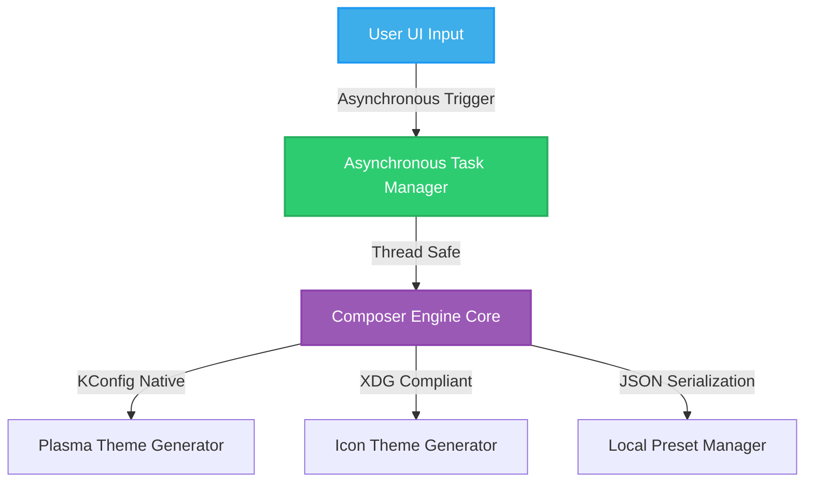

# Approved Refined Masterplan: Aesthetics, Presets, and Under-the-Hood Performance

Based on your selections, we have refined the masterplan to focus strictly on **UI/UX Elegance, Profile Presets (JSON), and Performance Architecture (Asynchronous Tasks)**. All sound events, cursor bundlers, color palette generators, and publishing tools have been **removed** to keep the utility lightweight and focused.

---

## 1. Approved Architecture & Workflow

---

## 2. Refined Scope of Improvements

### 🎨 Pillar A: Visual & UI/UX Masterclass
We will make the main mixer feel premium, fluid, and highly interactive:

* **Dynamic Wallpaper Loader:**
  - Let you choose **any custom image file** from your computer to use as the preview wallpaper!
  - Add a dedicated button under the preview to easily load, change, or reset the background wallpaper.
* **Editable Preview Widgets:**
  - Make the text inside the desktop *Delete File Dialog* and the *System Notification* **fully editable**. You can type directly into them to preview custom fonts and readability.
* **Glassmorphic Kirigami Cards:**
  - Standardize settings panels with subtle gradients, soft shadows, and clean borders using the approved `cardBorderColor`.

---

### 💾 Pillar B: Local Profile Presets
We will add a local saving and loading profile system:

* **Local JSON Profiles:**
  - Save your custom mixing combinations (which widgets, panels, and icons you paired together) to a local profile.
  - Presets will be stored cleanly in a standard local configuration file:
    `~/.config/plasmathemecomposer/presets.json`
  - A simple dropdown or selector card in the UI will let you quickly load, rename, or delete your saved mixtures.

---

### ⚡ Pillar C: Under-the-Hood Performance
We will overhaul the C++ engine to make it professional, fast, and completely main-thread safe.

> [!IMPORTANT]
> **Asynchronous Generation (Background Threads):**
> Currently, theme generation and directory copying run on the main UI thread, which can cause the app to stutter or briefly freeze. 
> We will offload the building process to background threads (`QtConcurrent` or `QThread`). The UI will stay 100% responsive, showing a fluid circular loader while the work completes in the background.

* **Transactional Rollbacks:**
  - If a theme build fails (due to full disk or write permission issues), the engine will automatically roll back and restore previous directories safely to prevent theme corruption.
* **Strict KConfig native parsing:**
  - Ensure all configuration structures use KDE's standard `KConfig` modules for robust execution.

---

### 📦 Pillar D: First-Class Desktop Integration
We will package the application to integrate seamlessly with standard Linux desktops:

* **XDG Integration:**
  - Include high-fidelity Appstream XML metadata, scalable launch icons, and a `.desktop` entry so the tool displays professionally inside KDE Discover and system application menus.

---

## 3. Implementation Timeline (Phased Roadmap)

- **Phase 1 (Performance Core):** Implement Asynchronous Threading for generation tasks & native `KConfig` parsing.
- **Phase 2 (Presets System):** Implement the local JSON Profile Manager (Save / Load / Delete presets).
- **Phase 3 (Aesthetics Expansion):** Add custom preview wallpaper selector & editable text previews.
- **Phase 4 (Packaging):** Add launcher icons, desktop file integration, and Appstream compliance.
